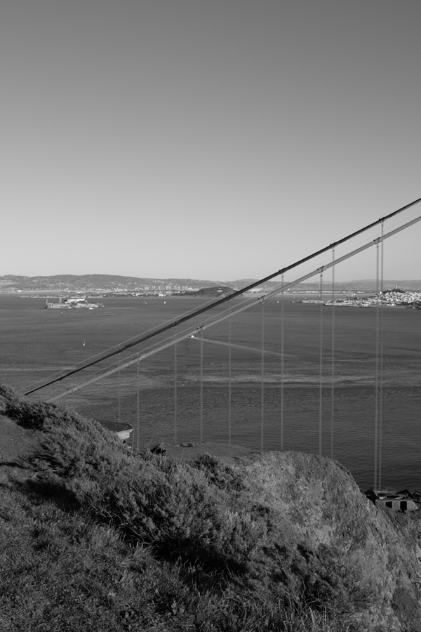

# GraphCut Textures

Make textures!

```shell script
python texture.py ../data/green.jpg
python texture.py ../data/strawberry.jpg
python texture.py ../data/keyboard.jpg
```

|             |                       Green                       |                       Strawberry                       |                       Keyboard                       |
| :---------: | :-----------------------------------------------: | :----------------------------------------------------: | :--------------------------------------------------: |
|   Source    |            |            |            |
| Synthesized |  |  |  |

Panorama stitching!

Image alignment codes adapted from [this blog](https://towardsdatascience.com/image-panorama-stitching-with-opencv-2402bde6b46c)

```shell script
python align.py
python stitch.py
```

| 00                          | 01                          | 02                          | 03                          | 04                          | 05                          |
| --------------------------- | --------------------------- | --------------------------- | --------------------------- | --------------------------- | --------------------------- |
|  |  |  |  |  |  |


