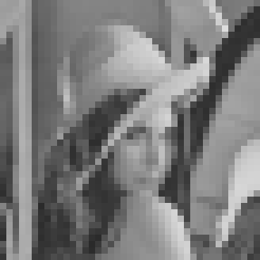
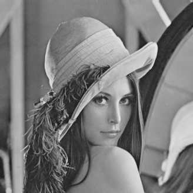

# Image Compression

# Getting Started

Compressing by truncating coefficients.

```sh
python trunc_coef.py --block-size 8 --keep-size 8
python trunc_coef.py --block-size 8 --keep-size 4
python trunc_coef.py --block-size 8 --keep-size 2
python trunc_coef.py --block-size 8 --keep-size 1
```

Compressing using quantization table.

```sh
python quant_table.py --table canon
python quant_table.py --table nikon
python quant_table.py --table jpeg
```

# Results

Original image


Truncating coefficients

| 1/1                     | 1/4                     | 1/16                    | 1/64                    |
| ----------------------- | ----------------------- | ----------------------- | ----------------------- |
|  |  |  |  |

Quantization table

| Canon                       | Nikon                       | JPEG                       |
| --------------------------- | --------------------------- | -------------------------- |
|  |  |  |
