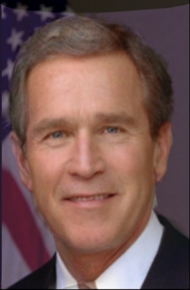
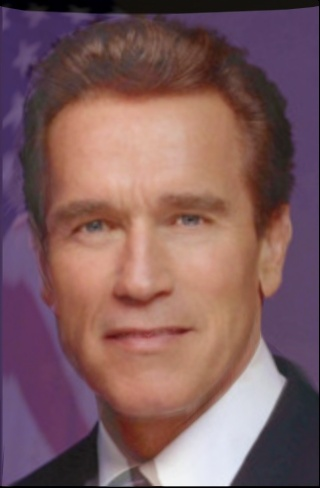
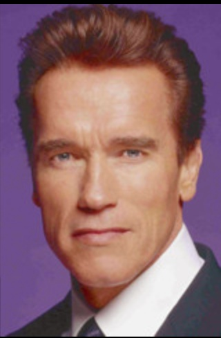
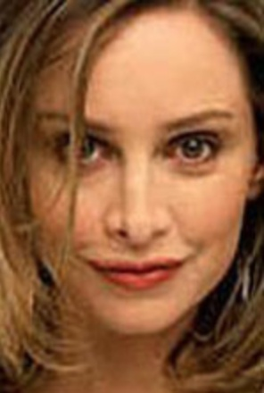
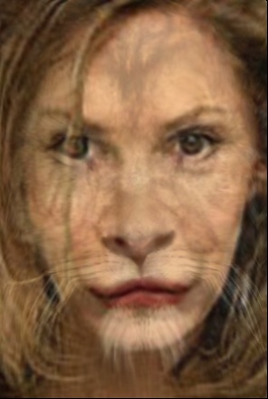
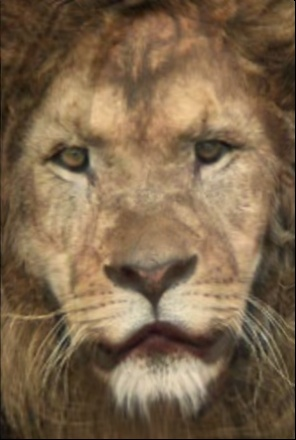
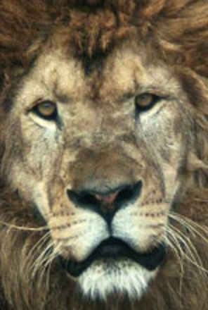

# Face Morphing

## Getting Started

Preprocess the images and landmarks.

```sh
python preprocess.py
```

Visualize key points and Delaunay triangulation.

```sh
python visualize.py
```

Generate morphing sequences.

```sh
python main.py
```

## Results

| Source                   | 33%                        | 67%                        | Target                   |
| ------------------------ | -------------------------- | -------------------------- | ------------------------ |
|  |  |  |  |
|  |  |  |  |

