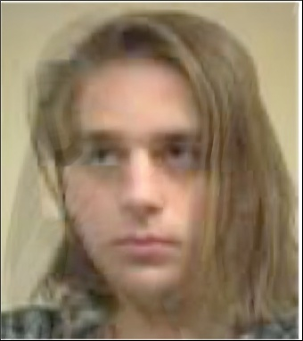
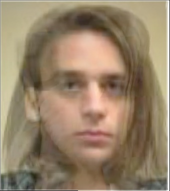
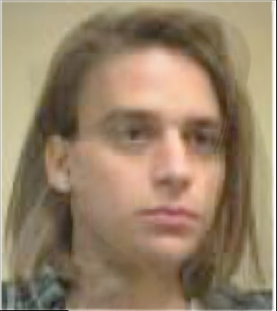
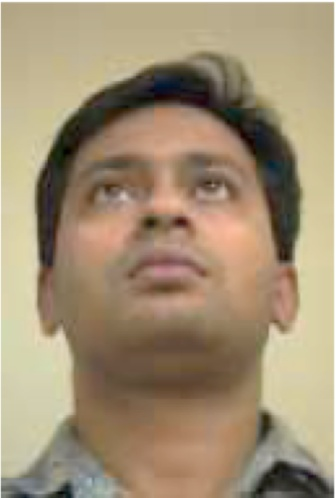
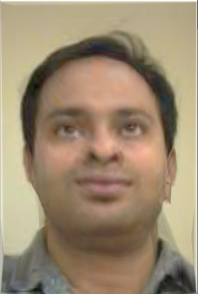
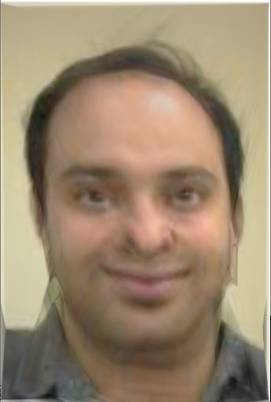
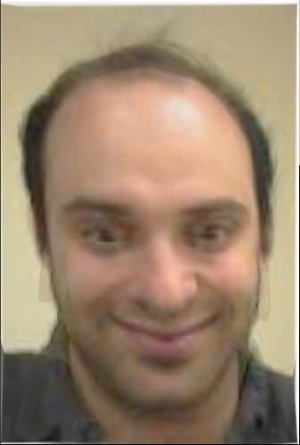
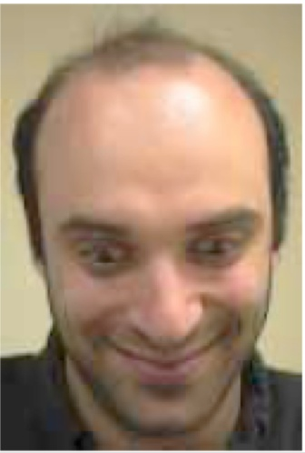

# View Morphing

## Getting Started

Set python path to reuse the codes in face morphing.

```sh
# at project1/view_morphing/
export PYTHONPATH=$(cd ../ && pwd):$PYTHONPATH
```

Run

```sh
python main.py
```

## Results

| Source                   | 25%                        | 50%                        | 75%                        | Target                   |
| ------------------------ | -------------------------- | -------------------------- | -------------------------- | ------------------------ |
|  |  |  |  |  |
|  |  |  |  |  |
|  |  |  |  |  |
|  |  |  |  |  |

