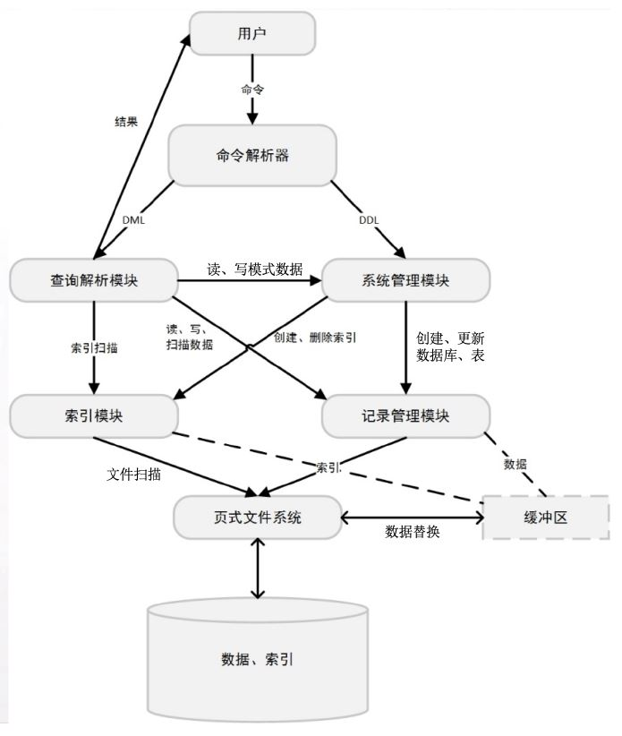

# 数据库系统概论：项目总结报告

> 2017011620  计73  李家昊

## 系统架构设计

系统架构与项目说明类似，如下图：



大致分为六大模块：命令解析器、查询解析模块、系统管理模块、索引模块、记录管理模块、页式文件系统。其中，

+ 命令解析器：负责将用户输入的SQL语句解析成抽象语法树，并解释执行。
+ 查询解析模块：负责处理用户对数据记录的增删改查操作。
+ 系统管理模块：负责处理表和索引的相关操作。
+ 索引模块：负责对某个字段建立索引，通过索引加速查询。
+ 记录管理模块：负责处理数据记录的增删改查。
+ 页式文件系统：负责按页读写文件，设有缓冲区。

## 模块详细设计

### 命令解析器（parser）

使用 Flex 实现词法解析器，Bison 实现文法解析器，只需指定语法规则及其翻译模式，即可生成解析器的 C 代码，根据用户输入的 SQL 构造抽象语法树。

得到抽象语法树后，将重新遍历该语法树，根据命令的类型、参数等信息解释执行该语句，对于数据定义语句（DDL），将交给系统模块处理，对于数据操作语句（DML），将交给查询解析模块处理。

### 查询解析模块（QL）

查询解析模块是本项目最复杂的一个模块，需要处理用户对数据的增删改查操作。对于任一操作，首先检查数据应当满足的约束，然后制定查询计划，查询到符合条件的记录，再根据操作类型调用索引模块和记录管理模块进行具体操作。

在各项操作之前，首先检查该表应该满足的约束，例如主键（非空且唯一），外键（完整性约束），非空，类型兼容等等。

建立查询计划时，首先根据where子句的条件，自动判断能否使用索引加速，若where子句中存在已有索引的字段，且右值为常量，则使用索引加速，否则，进行全表扫描，每个表的查询计划对应一个查询计划树节点。

1. 插入词条时，首先将词条插入记录管理模块，然后在有索引的字段上插入索引。
2. 删除词条时，首先建立查询计划，将查到的记录ID保存下来，再逐条删除记录，并从索引中删除。
3. 更新词条时，首先建立查询计划，将查到的记录ID保存下来，对于记录的更新，可原址修改，对于索引的更新，只能先删除再插入。
4. 查询词条时，首先建立查询计划，并在查询计划最后加入投影节点，根据查询计划扫描索引或记录文件，一边扫描一边输出，而不保存记录ID，防止爆内存；对于多表联合查询，需要在查询计划中建立一个笛卡尔积节点，它有两个子节点，扫描时固定左节点，遍历右节点，当右节点遍历完成后，左节点向前移动一步，然后重新扫描右节点。

### 系统管理模块（SM）

系统管理模块负责处理用户对表和数据库的操作，支持数据库的创建、使用、删除，表的创建、查询、修改、删除，本质上是对索引模块和记录管理模块的进一步封装。

### 索引模块（IX）

索引模块实现了 B+ 树索引，支持索引文件的创建、打开、关闭和删除，支持索引词条的增删查。具体实现为，每一页作为一个 B+ 树节点，记录父节点、属性值及孩子节点的列表，其中内部节点只存属性值和孩子页号，叶子节点存属性值和记录 ID。

1. 查询词条时，从根节点出发，节点内部顺序查找，找到第一个大于等于目标值的 key，选择该 key 对应的孩子，如此循环，直到找到叶子节点，相当于 lower_bound 接口。
2. 插入词条时，首先调用查询接口得到 lower_bound 的位置，在这个位置之前插入词条，如果节点满了，则分裂节点，将中间节点上溢到父节点，如果父节点也满了，则一直递归下去，直到根节点。
3. 删除词条时，目前实现的较为简单，查询到词条时，直接将记录 ID 置为空。

### 记录管理模块（RM）

实现了记录管理模块，支持记录文件的创建、打开、关闭和删除，支持记录的增删改查。具体实现为，将页面组织成一个链表，首页记录第一个空闲页面，每个空闲页都指向下一个空闲页。每个页面中，用 bitmap 维护记录槽的占用情况。

1. 查找记录时，直接通过页号和槽号计算偏移量，得到该记录。
2. 更新记录时，首先查找到该记录，然后直接更新。
3. 插入记录时，从首页找到第一页空闲页，如果不存在则创建，插入在第一个 bitmap 为 0 的位置，并把 bitmap 该位置为 1，如果插入后该页满了，需要维护首页的空闲页指针。
4. 删除记录时，将该记录删除并把 bitmap 该位置为 0，如果该页本来是满的，那么需要维护空闲页链表。

### 页式文件系统（PF）

本项目没有使用课程提供的文件系统代码，而是重新用 C 实现了一遍，支持：

1. 读写某个页面的内容，按页读写文件。
2. 缓存的 LRU 页面替换算法，支持多文件多页面的同时缓存。

相比于课程提供的文件系统，有下面几点改进：

1. 将所有页缓存开在全局数据区，通过空闲列表和占用列表来高效管理内存，避免频繁 malloc。
2. 支持多文件、多页面的同时缓存，改进哈希算法，降低碰撞概率，页面的分配和替换十分高效。

## 主要接口说明

### parser

主要接口如下，负责解析用户输入的SQL并解释执行。

```cpp
// parse SQL from stdin into AST
int yyparse ();
// print AST
void print_tree(sv_node_t *root, int offset);
// interpret SQL
RC exec_sql(sv_node_t *root);
```

### QL

主要接口如下，负责数据记录的增删改查。

```cpp
RC ql_select(std::vector<table_field_t> &sel_fields,
             const std::vector<std::string> &tables,
             const std::vector<condition_t> &conditions);
RC ql_insert(const std::string &tbname, const std::vector<value_t> &values);
RC ql_delete(const std::string &tbname, std::vector<condition_t> &conditions);
RC ql_update(const std::string &tbname,
             const std::vector<table_field_t> &set_fields,
             const std::vector<value_t> &rhs_values_,
             std::vector<condition_t> &conditions);
```

### SM

主要接口如下，负责数据库和表的增删改查。

```cpp
RC sm_show_databases();

RC sm_create_database(const char *dbname);
RC sm_drop_database(const char *dbname);
RC sm_use_database(const char *dbname);
RC sm_show_tables();

RC sm_create_table(const char *tbname, int num_fields, field_info_t *fields);
RC sm_drop_table(const char *tbname);
RC sm_desc_table(const char *tbname);

RC sm_create_index(const char *tbname, const char *colname);
RC sm_drop_index(const char *tbname, const char *colname);

RC sm_add_primary_key(const char *tbname, const std::vector<std::string> &colnames);
RC sm_drop_primary_key(const char *tbname);
RC sm_add_foreign_key(const char *tbname, const char *fkname, const std::vector<std::string> &colnames,
                      const char *ref_tbname, const std::vector<std::string> &ref_colnames);
RC sm_drop_foreign_key(const char *tbname, const char *fkname);

RC sm_rename_table(const char *tbname, const char *new_tbname);
RC sm_drop_col(const char *tbname, const char *colname);
RC sm_add_col(const char *tbname, char *colname, bool nullable, attr_type_t type, int len);
```

### IX

主要接口如下，负责索引词条的增删改查。

```cpp
RC ix_create_index(const char *filename, int index_no, attr_type_t attr_type, int attr_len);
RC ix_destroy_index(const char *filename, int index_no);
RC ix_open_index(const char *filename, int index_no, ix_file_handle_t *fh);
RC ix_close_index(ix_file_handle_t *ih);

RC ix_lower_bound(const ix_file_handle_t *fh, input_buffer_t key, iid_t *iid);
RC ix_upper_bound(const ix_file_handle_t *fh, input_buffer_t key, iid_t *iid);
RC ix_insert_entry(ix_file_handle_t *fh, input_buffer_t key, const rid_t *rid);
RC ix_delete_entry(ix_file_handle_t *fh, input_buffer_t key, const rid_t *rid);

bool ix_scan_equal(const iid_t *x, const iid_t *y);
RC ix_scan_next(const ix_file_handle_t *fh, iid_t *iid);
```

### RM

主要接口如下，负责记录的增删改查。

```cpp
RC rm_create_file(const char *filename, int record_size);
RC rm_destroy_file(const char *filename);
RC rm_open_file(const char *filename, rm_file_handle_t *fh);
RC rm_close_file(rm_file_handle_t *fh);

RC rm_get_record(const rm_file_handle_t *fh, const rid_t *rid, output_buffer_t buffer);
RC rm_insert_record(rm_file_handle_t *fh, input_buffer_t data, rid_t *rid);
RC rm_delete_record(rm_file_handle_t *fh, const rid_t *rid);
RC rm_update_record(rm_file_handle_t *fh, const rid_t *rid, input_buffer_t data);

RC rm_scan_init(rm_file_handle_t *fh, rid_t *rid);
RC rm_scan_next(rm_file_handle_t *fh, rid_t *rid);
bool rm_scan_is_end(const rid_t *rec);
```

### PF

主要接口如下，负责缓存磁盘页面，按页高效读写文件。

```cpp
RC pf_create_file(const char *filename);
RC pf_destroy_file(const char *filename);
RC pf_open_file(const char *filename, int *fd);
RC pf_close_file(int fd);

RC pf_create_page(int fd, int page_no, pf_page_ptr_t *out_page);
RC pf_fetch_page(int fd, int page_no, pf_page_ptr_t *out_page);
RC pf_access(pf_page_ptr_t page);
void pf_mark_dirty(pf_page_ptr_t page);
RC pf_force_page(pf_page_ptr_t page);
RC pf_flush_page(pf_page_ptr_t page);
RC pf_flush_file(int fd);
RC pf_read_page(int fd, int page_no, output_buffer_t buf, int num_bytes);
RC pf_write_page(int fd, int page_no, input_buffer_t buf, int num_bytes);
```

## 实验结果

本实验中，我独立实现了项目的所有基本要求，支持

+ 创建、使用、删除数据库，列出所有数据库。
+ 创建表，删除表，重命名表名，列出数据库内的所有表。
+ 在表中增加或删除一列，重命名一列。
+ 增加或删除主键，增加或删除外键，支持多列主键和多列外键。
+ 新建或删除索引，支持联合索引。
+ 数据记录的增删改查，支持where子句及AND操作，支持多表联合查询，支持投影。

## 小组分工

个人独立完成所有工作。

## 参考文献

+ Codd, E. F. (2002). A relational model of data for large shared data banks. In Software pioneers (pp. 263-294). Springer, Berlin, Heidelberg.
+ RedBase Project - CS346 Spring 2015. https://web.stanford.edu/class/cs346/2015/redbase.html
