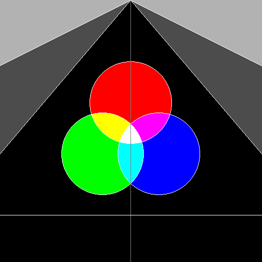

# 计算机图形学基础 PA0

> 2017011620  计73  李家昊

**你所实现的画线、画圆和区域填充逻辑是怎样的？你在实现中遇到了哪些问题？**

绘制直线的逻辑：实现了 Bresenham 算法，设直线方程为 $y = kx + b$，绘制从 $(x_0, y_0)$ 到 $(x_1, y_1)$ 的线段。

首先对直线的斜率 $k$ 分类，当 $|k| \le 1$ 时，扫描 $x$ 轴区间 $[x_0, x_1]$，先考虑 $k > 0$ 的情况（$k \le 0$ 时，做法类似），对于当前直线上一点 $(x_i,y_i)$，设当前像素为 $(x_i,y_p)$，其中 $y_p \in \{\lfloor y_i \rfloor, \lceil y_i \rceil\}$，误差为 $d=y_i - y_p$。考虑 $x_i + 1$ 时，直线上点 $(x_i + 1, y_{i+1})$ 与参考格点 $(x_i + 1, y_p)$ 的误差 $d$ 增加 $k$。当 $d < 0.5$ 时，直线上的点距离 $(x_i + 1, y_p)$ 最近，取之为下一像素；当 $d>0.5$ 时，直线上的点距离 $(x_i + 1, y_p + 1)$ 更近，应取之为下一像素，同时将误差 $d$ 减去 1。

```python
def draw_line(x0, y0, x1, y1):
    assert x0 <= x1
    d = 0.0
    k = (y1 - y0) / (x1 - x0)
    y = y0
    for x in [x0, x1]:
        draw_pixel(x, y)
        d += abs(k)
        if d >= 0.5:
            y += 1 if k > 0 else -1
            d -= 1.0
```

为了避免浮点运算，由于只需要判断 $d$ 的符号，故令 $e = 2(x_1 - x_0)(d - 0.5)$，即先对 $d$ 做 $-0.5$ 的偏移，然后对 $d$ 齐次扩大 $2(x_1 - x_0)$ 倍，则所有运算均变为整数运算。

```python
def draw_line(x0, y0, x1, y1):
    assert x0 <= x1
    e = -(x1 - x0)
    y = y0
    for x in [x0, x1]:
        draw_pixel(x, y)
        e += 2 * abs(y1 - y0)
        if e >= 0:
            y += 1 if k > 0 else -1
            e -= 2 * (x1 - x0)
```

当 $|k| > 1$ 时，直线较为陡峭，此时扫描 $x$ 轴将出现断点，因此应该扫描 $y$ 轴，只需将 $x,y$ 互换即可，做法类似，不再赘述。

绘制圆的逻辑：实现了中点画圆法，绘制满足 $x^2 + y^2 = r^2$ 的圆，扫描与 $x$ 轴夹角为 $45^\circ \sim 90^\circ$ 的 1/8 圆弧，对于当前圆上一点 $(x_i,y_i)$，记其当前像素为 $(x_p, y_p)$，考虑 $x_i + 1$ 时，下一像素可能为正右方点 $(x_i + 1,y_p)$ ，也可能为右下方点 $(x_i + 1, y_p - 1)$，两者中点的判别式为 $d = (x_p + 1)^2 + (y_p - 0.5)^2 - r^2$，若 $d < 0$，表明中点在圆内，应取正右方点为下一像素，且再下一像素的判别式为 $d_1 = (x_p + 2)^2 + (y_p - 0.5)^2 - r^2 = d + 2x_p + 3$；若 $d \le 0$，表明中点在圆外，应取右下方点为下一像素，且再下一像素的判别式为 $d_2 = (x_p + 2)^2 + (y_p - 1.5)^2 - r^2 = d + 2(x_p - y_p) + 5$。初始化每扫描一点，可利用对称性画出其他 7 个 1/8 圆弧上的对应点。

```python
def mid_point_circle(r):
    x = 0
    y = r
    d = 1.25 - r
    while x <= y:
        circle_points(x, y)
        if d < 0:
            d += 2 * x + 3
        else:
            d += 2 * (x - y) + 5
            y -= 1
        x += 1

def circle_points(x, y):
    for i, j in ((x, y), (x, -y), (-x, y), (-x, -y),
                 (y, x), (y, -x), (-y, x), (-y, -x)):
        draw_pixel(i, j)
```

区域填充的逻辑：实现了区域填充的扫描线算法，用一个栈维护所需扫描的水平线。首先将给定像素点压栈，每次取出栈顶的点，填充该点所在的水平线，直到遇到边界 $[x_l, x_r]$，检查上面一条水平线在 $[x_l, x_r]$ 区间中是否存在未涂色区域，确定是否需要扫描，将所需扫描的水平线中的某一点压栈，以同样的方法检查下面一条水平线，循环运行直到栈空。 

**你在完成作业的时候和哪些同学进行了怎样的讨论？是否借鉴了网上/别的同学的代码？**

没有与任何同学讨论。借鉴了教材上的代码，并进行了相应优化。

**你的代码有哪些未解决的bug？如果给你更多时间来完成作业，你将会怎样进行调试？**

暂时未发现有 bug，绘制和填充时均能正确处理图形的越界问题。

**你对本次作业有什么建议？文档或代码中有哪些需要我们改进的地方？**

文档已经比较完善，latex写的指导也很用心。代码很容易能读懂。

框架代码有个地方编译警告，希望可以修改一下，建议接收 `fgets` 的返回值，并判空。

```
/home/ljh/cg-2021/PA0/code/src/image.cpp: In static member function ‘static Image* Image::LoadPPM(const char*)’:
/home/ljh/cg-2021/PA0/code/src/image.cpp:155:10: warning: ignoring return value of ‘char* fgets(char*, int, FILE*)’, declared with attribute warn_unused_result [-Wunused-result]
  155 |     fgets(tmp,100,file);
      |     ~~~~~^~~~~~~~~~~~~~
/home/ljh/cg-2021/PA0/code/src/image.cpp:157:10: warning: ignoring return value of ‘char* fgets(char*, int, FILE*)’, declared with attribute warn_unused_result [-Wunused-result]
  157 |     fgets(tmp,100,file);
      |     ~~~~~^~~~~~~~~~~~~~
/home/ljh/cg-2021/PA0/code/src/image.cpp:159:10: warning: ignoring return value of ‘char* fgets(char*, int, FILE*)’, declared with attribute warn_unused_result [-Wunused-result]
  159 |     fgets(tmp,100,file);
      |     ~~~~~^~~~~~~~~~~~~~
/home/ljh/cg-2021/PA0/code/src/image.cpp:161:10: warning: ignoring return value of ‘char* fgets(char*, int, FILE*)’, declared with attribute warn_unused_result [-Wunused-result]
  161 |     fgets(tmp,100,file);
      |     ~~~~~^~~~~~~~~~~~~~
```

**实验结果**

| canvas01                      | canvas02                      |
| ----------------------------- | ----------------------------- |
|  |  |

