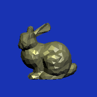

# 计算机图形学基础 PA1

> 2017011620  计73  李家昊

**你所实现的光线投射算法逻辑是怎样的？你在实现中遇到了哪些问题？**

主要流程是：对于图片上的某个像素，从相机焦点向该像素发出一条光线（射线），计算该光线与场景中物体的最近交点，如果没有交点，则将该像素置为背景色，否则，通过Phong模型求出最近交点的颜色，将其作为该像素的颜色。

对于平面求交，设平面方程为 $\vec{n} \cdot \vec{x} = D$，其中 $\vec{n}=(A,B,C)$ 为单位法向量，$\vec{x}=(x,y,z)$为平面上一点。光线方程为 $\vec{o} + t\vec{d}$，如果 $\vec{n} \cdot \vec{d} = 0$，表示直线平行于平面，此时无交点，否则，容易求出交点的 $t$ 为：

$$
t = \frac{D - \vec{n}\cdot \vec{o}}{\vec{n}\cdot \vec{d}}
$$

对于三角形求交，设三角形顶点为 $A,B,C$，首先求出三角形所在平面，其法向量为 $\vec{n}=\overrightarrow{AB}\times \overrightarrow{AC}$，偏移为 $D=\vec{n}\cdot \overrightarrow{OA}$，令光线与平面求交，如果没有交点，则说明直线与三角形不相交，否则，设交点为 $P$，它在三角形内（含边界）的充要条件是 $(\overrightarrow{AP} \times \overrightarrow{AB}) \cdot (\overrightarrow{AP}\times \overrightarrow{AC}) \le 0$ 且 $(\overrightarrow{BP}\times \overrightarrow{BA}) \cdot (\overrightarrow{BP}\times \overrightarrow{BC}) \le 0$。

对于球面求交，这里采用了几何法，设相机焦点为 $O$，光线单位方向为 $\vec{d}$，球的球心为 $C$，半径为 $r$，从球心对光线做垂线，交点为 $D$，首先判断 $O$ 是否在球上，如果在球上，则无交点，否则，求出 $t_D = |OD| = \overrightarrow{OC} \cdot \vec{d}$。

如果 $O$ 在球外且 $t_D<0$，则无交点，否则，求出 $|CD| = \sqrt{|CO|^2 - |OD|^2}$。

如果 $|CD|>r$，则无交点，否则，令 $\Delta t = \sqrt{r^2 - |CD|^2}$。如果 $O$ 在球外，则 $t = t_D - \Delta t$，如果 $O$ 在球内，则 $t=t_D + \Delta t$。

遇到的问题：求交时不能默认光线方向为单位向量，否则在 `transform` 时会产生错误的结果。正确的做法是：先将光线的方向向量的模长记录下来，将它归一化后计算得到 `t`，最后将 `t` 除以原始模长，才是交点处对应的真正的 `t`。

**你在完成作业的时候和哪些同学进行了怎样的讨论？是否借鉴了网上/别的同学的代码？**

与 方言 同学讨论了点是否在三角形内的判定方法，得到了比PPT上更简洁的做法。没有借鉴任何代码。

**如何编译你的代码并输出上述7个测试用例的渲染结果？如果你没有使用框架代码，请放上你渲染的图片结果。**

在 `code/` 目录下，直接执行 `bash run_all.sh` 即可。我使用了框架代码，这里也附上渲染效果。

| scene01                      | scene02                      | scene03                      | scene04                      |
| ---------------------------- | ---------------------------- | ---------------------------- | ---------------------------- |
|  |  |  |  |
| scene05                      | scene06                      | scene07                      |                              |
|  |  |  |                              |

**你的代码有哪些未解决的bug？如果给你更多时间来完成作业，你将会怎样进行调试？**

暂未发现有bug。

**你对本次编程作业有什么建议？文档或代码中有哪些需要我们改进的地方？**

建议规范一下 `bool Object3D::intersect(ray, &hit, tmin)` 的语义，对这个函数至少有两种理解：

1. 当光线与该物体相交且`t >= tmin`时，就将`t`和法向量写到`hit`中，并返回`true`。此时需要调用者维护光线最近的交点。
2. 当光线与该物体相交且`t >= tmin`时，先判断此时的`t`是否小于`hit.t`，如果是，则更新`hit`并返回`true`，否则，维持`hit`不变并返回`false`。此时由内层函数维护光线最近的交点。

两种理解下，`Group`和`Mesh`的实现有所不同，我这里采用了第1种实现，并对`Mesh`进行了相应修改。

此外建议修复一下 `fgets` 编译警告的问题。
