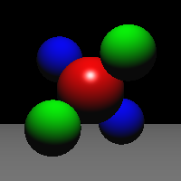
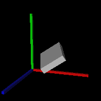
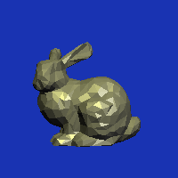
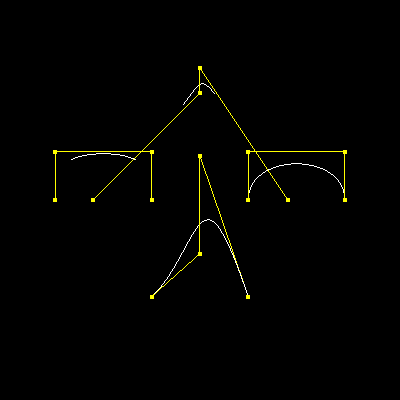
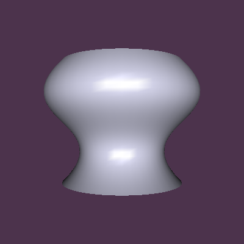

# 计算机图形学基础 PA3

> 2017011620  计73  李家昊

### 实验原理

本次实验中，我们需要求出 Bezier 和 B-Spline 曲线在指定参数下的坐标点及其切向量，从而绘制曲线和旋转面。

#### Bezier 曲线

给定 $n+1$ 个控制点 $\mathbf{P}_0,\mathbf{P}_1,\cdots,\mathbf{P}_n$，则在参数 $t$ 处，Bezier 曲线上的对应点定义为，
$$
\mathbf{B}(t) = \sum_{i=0}^n b_{i,n}(t) \mathbf{P}_i, \quad t\in [0,1]
$$
其中 $b_{i,n}(t)$ 为第 $i$ 个 $n$ 阶 Bernstein 多项式，也称为 Bezier 曲线的基函数，定义为，
$$
b_{i,n}(t) = C_n^i t^i (1-t)^{n-i} = \frac{n!}{i!(n-i)!}t^i (1-t)^{n-i}, \quad i=0,1,\cdots,n
$$
给定参数 $t$，根据上面两式可求得曲线上一点，但我们还需要求出该点处的一阶导数，首先对 $b_{i,n}(t)$ 求导，
$$
\begin{aligned}
b_{i,n}'(t) &= C_n^i it^{i-1}(1-t)^{n-i} - C_n^i (n-i)t^i(1-t)^{n-i-1} \\
&= nC_{n-1}^{i-1} t^{i-1}(1-t)^{n-i} - nC_{n-1}^i t^i (1-t)^{n-i-1} \\
&= n(b_{i-1,n-1}(t) - b_{i,n-1}(t))
\end{aligned}
$$
注意在边界处有 $b_{-1,n-1}(t) \equiv b_{n,n-1}(t) \equiv 0$。下面考虑 $\mathbf{B}(t)$ 整体的导数，
$$
\begin{aligned}
\mathbf{B}'(t) &= \sum_{i=0}^n b_{i,n}'(t) \mathbf{P}_i \\
&= \sum_{i=0}^n n(b_{i-1,n-1}(t) - b_{i,n-1}(t)) \mathbf{P}_i \\
&= n\sum_{i=0}^{n-1} b_{i,n-1}(t) (\mathbf{P}_{i+1} - \mathbf{P}_i)
\end{aligned}
$$
记 $\mathbf{Q}_i = n(\mathbf{P}_{i+1} - \mathbf{P}_i), \enspace i=0,1,\cdots,n-1$，则上式可表示为，
$$
\mathbf{B}'(t) = \sum_{i=0}^{n-1} b_{i,n-1}(t)\mathbf{Q}_i
$$
这表明 Bezier 曲线的导数是一条比原曲线低一阶的 Bezier 曲线，可以完全采用求 Bezier 曲线上一点的方法来求 Bezier 曲线的导数。

#### B-Spline 曲线

对于一个有 $n+1$ 个控制点 $\mathbf{P}_0,\mathbf{P}_1,\cdots,\mathbf{P}_n$ 的 $p$ 次（$p+1$ 阶）B-Spline 曲线，在参数 $t$ 处，曲线上一点定义为，
$$
\mathbf{S}(t) = \sum_{i=0}^n B_{i,p}(t) \mathbf{P}_i
$$
其中 $B_{i,p}(t)$ 为基函数，递归定义为，
$$
\begin{aligned}
B_{i,0}(t) &= \begin{cases}
1, & t_i \le t < t_{i+1} \\
0, & \text{otherwise}
\end{cases}
, \quad 0 \le i < n+p+1 \\
B_{i,j}(t) &= \frac{t-t_i}{t_{i+j}-t_i}B_{i,j-1}(t)+\frac{t_{i+j+1}-t}{t_{i+j+1}-t_{i+1}}B_{i+1,j-1}(t), \quad 1\le j \le p
\end{aligned}
$$
其中 $T=\{t_i\}_{i=0}^{n+p+1}$ 为控制序列（Knot Vector），满足以下条件
$$
0\le t_0 \le t_1 \le \cdots \le t_{n+p+1} \le 1
$$
在本实验中，Knot Vector 统一定义如下，
$$
t_i = \frac{i}{n+p+1}, \quad 0\le i \le n+p+1
$$
对于参数 $t$ 处的导数，通过递推式可求得，
$$
B_{i,p}'(t)=p\left(\frac{B_{i,p-1}(t)}{t_{i+p}-t_i} - \frac{B_{i+1,p-1}(t)}{t_{i+p+1}-t_{i+1}}\right)
$$
考虑 $\mathbf{S}(t)$ 整体的导数，注意边界上有 $B_{0,p-1}(t) \equiv B_{n+1,p-1} \equiv 0$，因此，
$$
\begin{aligned}
\mathbf{S}'(t) &= \sum_{i=0}^n B_{i,p}'(t)\mathbf{P}_i \\
&= p\left(\sum_{i=1}^n \frac{B_{i,p-1}(t)}{t_{i+p}-t_i}\mathbf{P}_i - \sum_{i=0}^{n-1} \frac{B_{i+1,p-1}(t)}{t_{i+p+1}-t_{i+1}}\mathbf{P}_i\right) \\
&= p\sum_{i=0}^{n-1} B_{i+1,p-1}(t)\frac{\mathbf{P}_{i+1}-\mathbf{P}_i}{t_{i+p+1}-t_{i+1}} 
\end{aligned}
$$
记 $\mathbf{Q}_i=p\dfrac{\mathbf{P}_{i+1}-\mathbf{P}_i}{t_{i+p+1}-t_{i+1}} $，则有，
$$
\mathbf{S}'(t) = \sum_{i=0}^{n-1} B_{i+1,p-1}(t) \mathbf{Q}_i
$$
令新的控制序列为 $T'=\{t_i\}_{i=1}^{n}$，则在 $T'$ 上有，
$$
\mathbf{S}'(t) = \sum_{i=0}^{n-1} B_{i,p-1}(t) \mathbf{Q}_i
$$
即 B-Spline 曲线的导数也是一条 B-Spline 曲线，其次数比原曲线低一次。

#### Bezier vs B-Spline

Bezier 曲线是 B-Spline 的一个特例，在 B-Spline 曲线中，令次数 $p=n$，$t_0=t_1=\cdots=t_n=0$，$t_{n+1}=\cdots=t_{n+p+1}=1$，则容易验证 $B_{i,p}(t) \equiv b_{i,n}(t)$，因此，我们可以用同一套算法统一计算 Bezier 和 B-Spline 曲线的坐标及导数。

#### De Boor 算法

De Boor 算法是一个计算 B-Spline 曲线的动态规划算法，它并不计算每个基函数，而是直接求出最终值 $\mathbf{S}(t)$。伪代码如下

```python
def deBoor(k: int, x: int, t, c, p: int):
    """Evaluates S(x).

    Arguments
    ---------
    k: Index of knot interval that contains x.
    x: Position.
    t: Array of knot positions, needs to be padded as described above.
    c: Array of control points.
    p: Degree of B-spline.
    """
    d = [c[j + k - p] for j in range(0, p + 1)]

    for r in range(1, p + 1):
        for j in range(p, r - 1, -1):
            alpha = (x - t[j + k - p]) / (t[j + 1 + k - r] - t[j + k - p])
            d[j] = (1.0 - alpha) * d[j - 1] + alpha * d[j]

    return d[p]
```

### 思考题

**Bezier 曲线和 B 样条曲线有什么异同？怎样绘制一个首尾相接且接点处也有连续性质的 B 样条？**

异：Bezier 曲线是 B 样条曲线的一个特例，相比于 Bezier 曲线，B 样条曲线支持局部修改和编辑，拼接处容易保证几何连续性质，次数不依赖于控制点的个数，曲线不容易产生抖动。同：导数都是低一阶曲线，原曲线和导数均可通过 De Boor 算法计算。

令最后 $p+1$ 个控制点与最初 $p+1$ 个控制点完全重合，即可绘制一个首尾相接且接点处也有连续性质的 B 样条。

**阅读 revsurface.hpp 中绘制旋转曲面的代码，简述其主要绘制逻辑。**

本质上是一个采样重建的过程。首先按指定分辨率对曲线采样，得到曲线上一系列离散点及其法向量，然后对旋转角采样，得到曲线上每点绕纵轴旋转一周的坐标序列，最后将曲线上相邻两点的旋转序列重组成一系列三角面片，调用 OpenGL 绘制接口即可。

**你在完成作业的时候和哪些同学进行了怎样的讨论？是否借鉴了网上/别的同学的代码？**

没有与任何同学讨论，借鉴了维基百科上 De Boor's Algorithm 的伪代码：https://en.wikipedia.org/wiki/De_Boor%27s_algorithm。

### 实验结果

| scene01                      | scene04                      | scene06                      |
| ---------------------------- | ---------------------------- | ---------------------------- |
|  |  |  |
| scene08                      | scene09                      | scene10                      |
|  |  |  |

### 参考资料

+ Wikipedia contributors. (2021, May 3). Bézier curve. In *Wikipedia, The Free Encyclopedia*. Retrieved 13:19, May 3, 2021, from [https://en.wikipedia.org/w/index.php?title=B%C3%A9zier_curve&oldid=1021190884](https://en.wikipedia.org/w/index.php?title=Bézier_curve&oldid=1021190884)
+ Wikipedia contributors. (2021, April 10). B-spline. In *Wikipedia, The Free Encyclopedia*. Retrieved 13:17, May 3, 2021, from https://en.wikipedia.org/w/index.php?title=B-spline&oldid=1017102480
+ Wikipedia contributors. (2020, August 19). De Boor's algorithm. In *Wikipedia, The Free Encyclopedia*. Retrieved 13:18, May 3, 2021, from [https://en.wikipedia.org/w/index.php?title=De_Boor%27s_algorithm&oldid=973824413](https://en.wikipedia.org/w/index.php?title=De_Boor's_algorithm&oldid=973824413)

