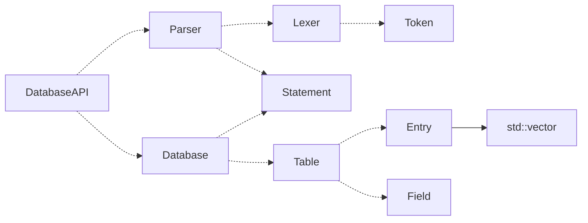
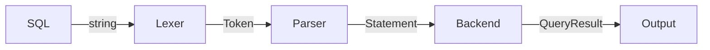

# SimpleSQL

A simple cross-platform relational database with SQL query support. 

## Runtime Environment

经过测试，在下列环境下程序能正常运行。

1. Windows 10
2. Linux Ubuntu 16.04

未在 Mac 上进行测试，因为没有苹果电脑。

## Prerequisites

1. g++ (with c++11 support )
2. GNU Make
3. cmake

## Build

```bash
$ cd SimpleSQL
$ mkdir build && cd build 
$ cmake .. -G "Unix Makefiles" 
$ make -j4
```

## Run

在 `build/` 目录下找到可执行文件 `main2` 或 `main2.exe`，用命令行启动即可。

## Modules 

本工程分为三个模块，分别为parser, backend, team_c_api。

### Parser

Parser 为前端解析器模块，当用户从键盘输入SQL语句时，首先通过词法解析器 Lexer 将SQL语句分割为一系列的Token，然后通过 Parser 分析 Token 与 Token 之间的逻辑关系，构建解析树，将有用的信息存放在不同类型的 Statement 中，并返回给调用者，调用者可将 Statement 传到后端模块，进行数据库的后端操作。

### Backend

Backend 为数据库后端模块，是真正执行SQL语句的模块。后端模块使用 Database Manager 管理多个 Database，Database 下管理多个 Table，Table 下管理多个词条。它提供所有功能对应的代码接口，调用者需要通过 parser 解析出的 Statement 的类型，调用对应的后端接口，实现数据库操作。

### Team_c_api

这是 C 组第一阶段的接口代码，它接受用户输入的 SQL 命令，调用 parser 解析命令，得到一个 Statement ，然后根据 Statement 的类型，调用 backend 对应的接口，执行 SQL 命令，从而将前后端连接起来，完成对数据库的控制。

## Architecture

项目架构如下图所示（请用typora等markdown可视化工具打开此文档）。图中虚线表示依赖关系，实线表示继承关系。



运行流程如下图所示：



## Auto test

提供一个自动测试脚本 `autocheck.py`，使用前请确保 `1_in_file` 在当前目录下，用法如下：

```bash
$ python autocheck.py --prog PATH_TO_MAIN_PROGRAM --dir TEST_DIRECTORY
```

参数 `--prog` 表示 `main2` 程序的路径。

参数 `--dir` 表示测试目录。

程序会自动扫描测试目录下所有 `.sql` 文件，作为指定程序的输入，并将输出结果与同名的 `.out` 文件比对。

Example Usage: 

```bash
$ python autocheck.py --prog build/main2 --dir test/		# linux 
$ python autocheck.py --prog build\main2.exe --dir test/	# windows
```

## Documentation

详细的说明文档请参见： <https://li-plus.github.io/SimpleSQL/index.html> 

详细的UML请参见： <https://li-plus.github.io/SimpleSQL/databaseapi_8h.html> 

仓库已经公开，地址为： <https://github.com/Li-plus/SimpleSQL> 
